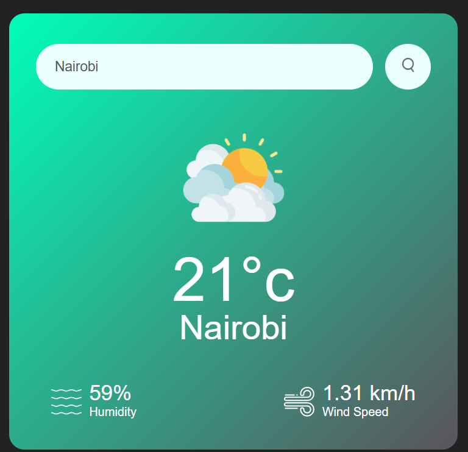

# 🌦️ Weather App

A simple, clean weather app built using the OpenWeatherMap API. Search for any city worldwide to get real-time weather details such as temperature, humidity, and wind speed.

🔗 **Live Demo**: [anneshaahsan.github.io/Weather-App](https://anneshaahsan.github.io/Weather-App/)

---

## 📸 Preview



---

## ✨ Features

- 🌍 Search by city name worldwide
- 🌡️ Shows current temperature in Celsius
- 💧 Displays humidity and wind speed
- 🔄 Live API data from OpenWeatherMap
- 🌓 Responsive and visually clean UI

---

## 🛠️ Tech Stack

- **HTML5**
- **CSS3**
- **Vanilla JavaScript**
- **OpenWeatherMap API**

---

## 🚀 Getting Started (Run Locally)

To run the project locally:

```bash
git clone https://github.com/anneshaahsan/Weather-App.git
cd Weather-App
